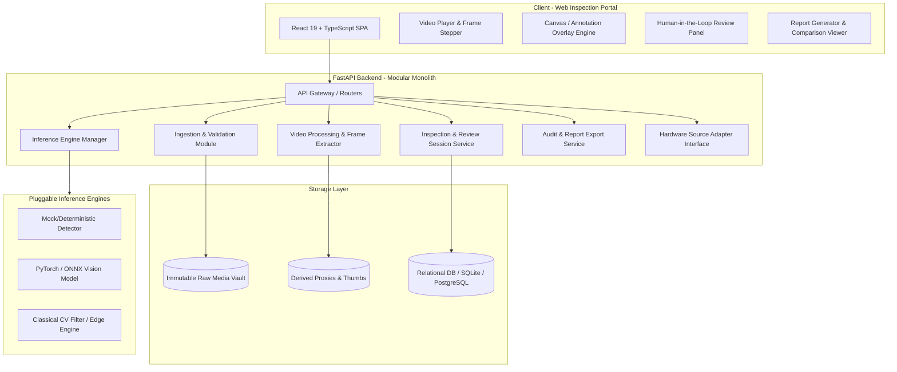

# KeeAInu — Architecture & System Design

**Version**: 1.0.0  
**Pattern**: Modular Monolith with Decoupled Computer Vision & Inference Engines  
**Status**: Approved Foundation Blueprint

---

## 1. High-Level Architectural Diagram

---

## 2. Core Modules & Responsibilities

### 2.1 Ingestion & Validation Module (`backend/app/modules/ingestion`)
- Safely accepts uploaded video and image streams.
- Performs magic byte signature validation, duration checks, resolution checks, and malware/malformed container scanning.
- Calculates SHA-256 evidence hashes and persists raw files to the read-only Media Store.

### 2.2 Video Processing & Frame Extractor (`backend/app/modules/video`)
- Extracts frame-level accurate frames using OpenCV / static decoding bindings.
- Generates low-resolution scrubber proxies and timeline thumbnails.
- Provides timestamp-to-frame index lookup tables.

### 2.3 Pluggable Inference Engine Manager (`backend/app/modules/inference`)
- Implements a uniform `InferenceEngine` interface.
- Dispatches individual frames or batches to registered detection models.
- Returns standardized `InferenceResult` structures (coordinates, class, confidence, metadata).
- Supports mock, ONNX, PyTorch, and external model adapters.

### 2.4 Inspection & Session Management (`backend/app/modules/inspection`)
- Manages Assets, Inspection Sessions, Findings, and Inspector Review actions.
- Records all state changes with immutable audit trails.
- Supports finding confirmation, modification, classification, and severity tagging.

### 2.5 Report Generation & Evidence Export (`backend/app/modules/reporting`)
- Compiles validated findings, high-resolution annotated frame captures, and inspector commentary into standardized PDF and JSON reports.
- Packages full NDT audit bundles.

### 2.6 Hardware Source Adapter (`backend/app/modules/hardware`)
- Defines the hardware connector interface for Yateks series (G, M, Q, B, P).
- Manages device discovery, capture card ingestion, and connection health monitoring.

---

## 3. Data Flow

1. **Ingest**: User or hardware imports footage -> SHA-256 calculated -> Raw media locked in MediaStore -> Session record created.
2. **Process**: Frame metadata extracted -> Proxy thumbnails generated for timeline scrubbing.
3. **Analyze**: Inspector triggers AI analysis (or auto-scans) -> `InferenceEngine` generates candidate defect bounding boxes.
4. **Review**: Inspector steps through candidate frames -> Confirms/adjusts/rejects findings -> System records audit log.
5. **Report**: Inspector closes session -> System generates signed, traceable NDT report.
