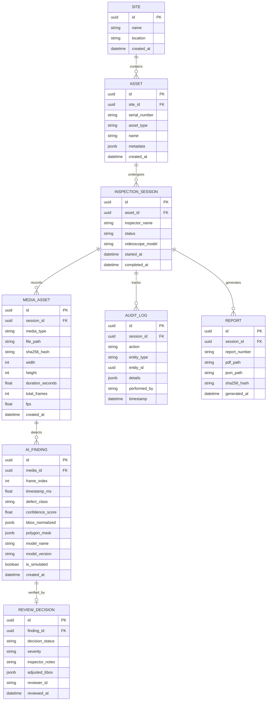

# KeeAInu — Data Model & Schema Specification

**Version**: 1.0.0  
**Storage**: Relational / SQL-backed schema (SQLite for local dev, PostgreSQL for production)

---

## 1. Entity-Relationship Diagram

---

## 2. Status Enums & Taxonomies

### 2.1 Inspection Session Status
- `DRAFT`: Session initiated, footage upload/processing underway.
- `IN_REVIEW`: Video processed, inspector actively analyzing and reviewing findings.
- `COMPLETED`: Review finished, session signed off and locked against modifications.
- `ARCHIVED`: Historical session.

### 2.2 Finding Review Status
- `PENDING_REVIEW`: Raw candidate finding detected by AI; not yet reviewed by engineer.
- `CONFIRMED`: Engineer validated defect presence and classification.
- `ADJUSTED`: Engineer modified bounding box, classification, or notes.
- `REJECTED`: Engineer rejected false positive finding.
- `MANUAL_ADD`: Finding directly created by engineer without prior AI detection.

### 2.3 Candidate Defect Taxonomy (Industrial Videoscope Domain)
- `CRACK`: Linear surface fissures or fracture lines.
- `CORROSION`: Surface oxidation, pitting, or rust buildup.
- `WEAR`: Material loss due to friction or abrasion.
- `DEPOSIT`: Foreign material accumulation, slag, or carbon buildup.
- `BLOCKAGE`: Internal obstruction within tube, pipe, or conduit.
- `DEFORMATION`: Mechanical bending, denting, or structural warping.
- `SURFACE_DAMAGE`: Scratches, gouges, or heat discoloration.
